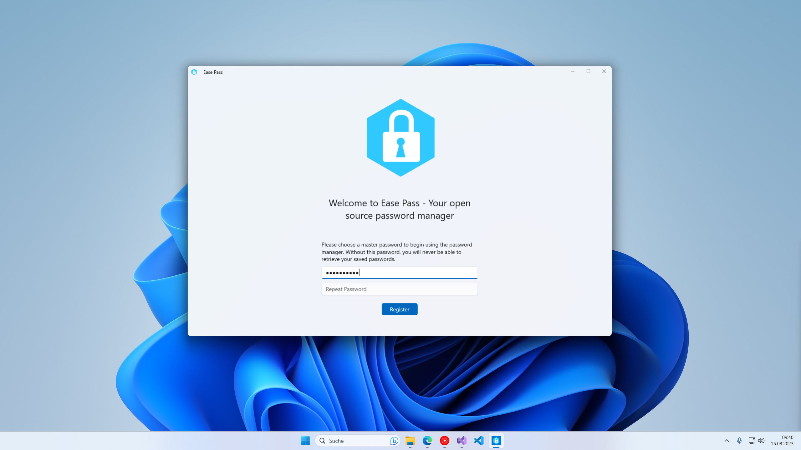
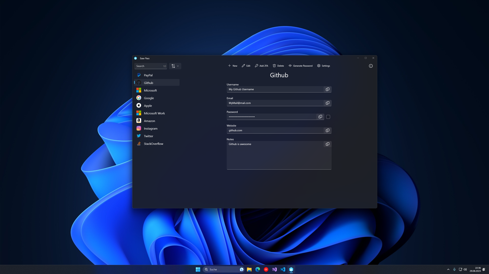

 

    
 

 <h1  align="center">EasePass</h1>

     <!---->
      
    
    
    

### What is Ease Pass?
Ease Pass is a simple password manager designed to streamline password management. With this application, you can conveniently store, edit, and organize your passwords securely. The project is a work in progress, focusing on providing a user-friendly interface to save and manage passwords, and future enhancements are underway to further enhance its capabilities.

### Time spent on this project:

## Images

