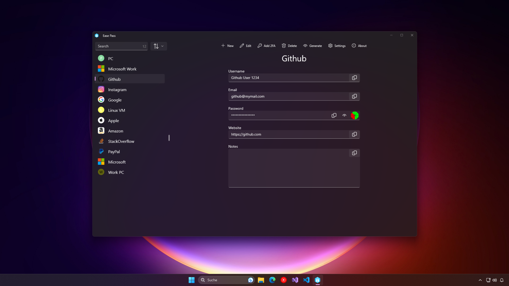
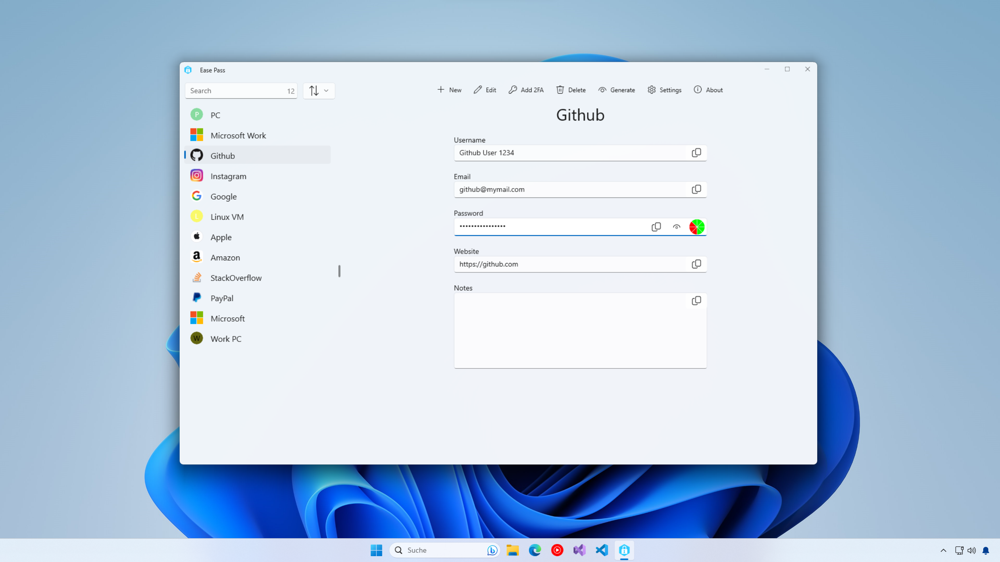
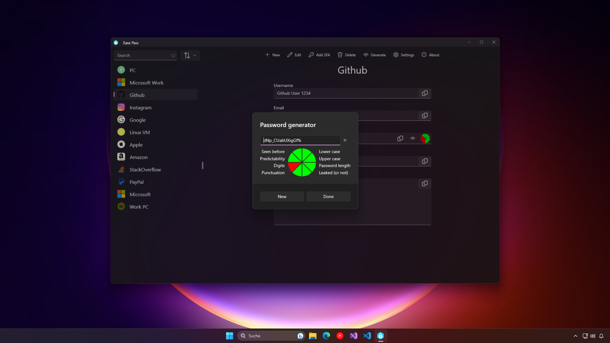

 

    
 

 <h1  align="center">Ease Pass</h1>

    
    
    
    
    

## 🤔 What is Ease Pass?
Ease Pass is a simple password manager designed to streamline password management. With this application, you can conveniently store, edit, and organize your passwords securely. The project is a work in progress, focusing on providing a user-friendly interface to save and manage passwords, and future enhancements are underway to further enhance its capabilities.

## 📥Download

## 🔍 Features
- Offline and Secure
- Simple but intuitive and clean-looking design
- Generate Secure Passwords
- Generate 2FA tokens
- Fast search
- Print your database as PDF or on Paper
- Export and Import your passwords encrypted
- Sort and order your passwords
- Plugin support to extend the functionality.
- Import your passwords from the Browser
- Import your wifi passwords from Windows

## 👨‍👩‍👧‍👦 Contribute to EasePass
- Code Contributions: Fork, enhance and submit pull requests on GitHub.
- Bug Reports: Help us by reporting glitches or bugs on our GitHub repository.
- Feature Requests: Share your ideas for new features.
- Translations: Contribute to making EasePass more inclusive.

## 🚀 Run on your machine
1. Clone the repository.
2. Make sure you have the correct dependencies for Winui3 development installed in Visual Studio
3. Open the .sln file in the root folder
4. in Visual Studio start the EasePass package and wait for it to build.

## 📸 Images

